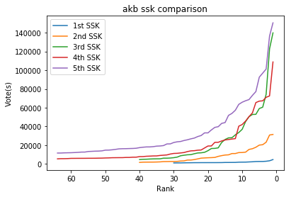

```python
import pandas as pd
from matplotlib import pyplot as plt
# compare ssk's
sample_data = pd.read_csv('akb.csv')
first = sample_data[sample_data.Single == 1]
second = sample_data[sample_data.Single == 2]
third = sample_data[sample_data.Single == 3]
fourth = sample_data[sample_data.Single == 4]
fifth = sample_data[sample_data.Single == 5]
a = first.Rank
b = first.Votes
c = second.Rank
d = second.Votes
e = third.Rank
f = third.Votes
g = fourth.Rank
h = fourth.Votes
i = fifth.Rank
j = fifth.Votes
plt.plot(a , b)
plt.plot(c , d)
plt.plot(e , f)
plt.plot(g , h)
plt.plot(i , j)
plt.title('akb ssk comparison')
plt.legend(['1st SSK','2nd SSK','3rd SSK','4th SSK','5th SSK'])
plt.ylabel('Vote(s)')
plt.xlabel('Rank')
ax = plt.gca()
ax.invert_xaxis()
plt.show()
```





```python
sample_data
```


<div>
<style scoped>
    .dataframe tbody tr th:only-of-type {
        vertical-align: middle;
    }

    .dataframe tbody tr th {
        vertical-align: top;
    }

    .dataframe thead th {
        text-align: right;
    }
</style>
<table border="1" class="dataframe">
  <thead>
    <tr style="text-align: right;">
      <th></th>
      <th>Single</th>
      <th>Rank</th>
      <th>Name</th>
      <th>Team</th>
      <th>Votes</th>
    </tr>
  </thead>
  <tbody>
    <tr>
      <th>0</th>
      <td>1</td>
      <td>1</td>
      <td>前田敦子</td>
      <td>A</td>
      <td>4630</td>
    </tr>
    <tr>
      <th>1</th>
      <td>1</td>
      <td>2</td>
      <td>大島優子</td>
      <td>K</td>
      <td>3345</td>
    </tr>
    <tr>
      <th>2</th>
      <td>1</td>
      <td>3</td>
      <td>篠田麻里子</td>
      <td>A</td>
      <td>2852</td>
    </tr>
    <tr>
      <th>3</th>
      <td>1</td>
      <td>4</td>
      <td>渡辺麻友</td>
      <td>B</td>
      <td>2625</td>
    </tr>
    <tr>
      <th>4</th>
      <td>1</td>
      <td>5</td>
      <td>高橋みなみ</td>
      <td>A</td>
      <td>2614</td>
    </tr>
    <tr>
      <th>5</th>
      <td>1</td>
      <td>6</td>
      <td>小嶋陽菜</td>
      <td>A</td>
      <td>2543</td>
    </tr>
    <tr>
      <th>6</th>
      <td>1</td>
      <td>7</td>
      <td>板野友美</td>
      <td>A</td>
      <td>2281</td>
    </tr>
    <tr>
      <th>7</th>
      <td>1</td>
      <td>8</td>
      <td>佐藤亜美菜</td>
      <td>A</td>
      <td>2117</td>
    </tr>
    <tr>
      <th>8</th>
      <td>1</td>
      <td>9</td>
      <td>柏木由紀</td>
      <td>B</td>
      <td>1920</td>
    </tr>
    <tr>
      <th>9</th>
      <td>1</td>
      <td>10</td>
      <td>河西智美</td>
      <td>K</td>
      <td>1890</td>
    </tr>
    <tr>
      <th>10</th>
      <td>1</td>
      <td>11</td>
      <td>小野恵令奈</td>
      <td>K</td>
      <td>1838</td>
    </tr>
    <tr>
      <th>11</th>
      <td>1</td>
      <td>12</td>
      <td>秋元才加</td>
      <td>K</td>
      <td>1599</td>
    </tr>
    <tr>
      <th>12</th>
      <td>1</td>
      <td>13</td>
      <td>北原里英</td>
      <td>A</td>
      <td>1578</td>
    </tr>
    <tr>
      <th>13</th>
      <td>1</td>
      <td>14</td>
      <td>宮澤佐江</td>
      <td>K</td>
      <td>1547</td>
    </tr>
    <tr>
      <th>14</th>
      <td>1</td>
      <td>15</td>
      <td>佐藤由加理</td>
      <td>A</td>
      <td>1539</td>
    </tr>
    <tr>
      <th>15</th>
      <td>1</td>
      <td>16</td>
      <td>峯岸みなみ</td>
      <td>A</td>
      <td>1414</td>
    </tr>
    <tr>
      <th>16</th>
      <td>1</td>
      <td>17</td>
      <td>浦野一美</td>
      <td>B</td>
      <td>1395</td>
    </tr>
    <tr>
      <th>17</th>
      <td>1</td>
      <td>18</td>
      <td>宮崎美穂</td>
      <td>A</td>
      <td>1373</td>
    </tr>
    <tr>
      <th>18</th>
      <td>1</td>
      <td>19</td>
      <td>松井珠理奈</td>
      <td>S</td>
      <td>1371</td>
    </tr>
    <tr>
      <th>19</th>
      <td>1</td>
      <td>20</td>
      <td>多田愛佳</td>
      <td>B</td>
      <td>1365</td>
    </tr>
    <tr>
      <th>20</th>
      <td>1</td>
      <td>21</td>
      <td>倉持明日香</td>
      <td>K</td>
      <td>1355</td>
    </tr>
    <tr>
      <th>21</th>
      <td>1</td>
      <td>22</td>
      <td>米沢瑠美</td>
      <td>B</td>
      <td>1352</td>
    </tr>
    <tr>
      <th>22</th>
      <td>1</td>
      <td>23</td>
      <td>高城亜樹</td>
      <td>A</td>
      <td>1322</td>
    </tr>
    <tr>
      <th>23</th>
      <td>1</td>
      <td>24</td>
      <td>大堀恵</td>
      <td>K</td>
      <td>1316</td>
    </tr>
    <tr>
      <th>24</th>
      <td>1</td>
      <td>25</td>
      <td>増田有華</td>
      <td>K</td>
      <td>1247</td>
    </tr>
    <tr>
      <th>25</th>
      <td>1</td>
      <td>26</td>
      <td>平嶋夏海</td>
      <td>B</td>
      <td>1216</td>
    </tr>
    <tr>
      <th>26</th>
      <td>1</td>
      <td>27</td>
      <td>指原莉乃</td>
      <td>B</td>
      <td>1170</td>
    </tr>
    <tr>
      <th>27</th>
      <td>1</td>
      <td>28</td>
      <td>片山陽加</td>
      <td>B</td>
      <td>1089</td>
    </tr>
    <tr>
      <th>28</th>
      <td>1</td>
      <td>29</td>
      <td>松井玲奈</td>
      <td>S</td>
      <td>1073</td>
    </tr>
    <tr>
      <th>29</th>
      <td>1</td>
      <td>30</td>
      <td>松原夏海</td>
      <td>K</td>
      <td>1050</td>
    </tr>
    <tr>
      <th>...</th>
      <td>...</td>
      <td>...</td>
      <td>...</td>
      <td>...</td>
      <td>...</td>
    </tr>
    <tr>
      <th>208</th>
      <td>5</td>
      <td>35</td>
      <td>永尾まりや</td>
      <td>K</td>
      <td>18978</td>
    </tr>
    <tr>
      <th>209</th>
      <td>5</td>
      <td>36</td>
      <td>倉持明日香</td>
      <td>K</td>
      <td>18435</td>
    </tr>
    <tr>
      <th>210</th>
      <td>5</td>
      <td>37</td>
      <td>兒玉遥</td>
      <td>H</td>
      <td>18145</td>
    </tr>
    <tr>
      <th>211</th>
      <td>5</td>
      <td>38</td>
      <td>田野優花</td>
      <td>A</td>
      <td>18125</td>
    </tr>
    <tr>
      <th>212</th>
      <td>5</td>
      <td>39</td>
      <td>梅本まどか</td>
      <td>E</td>
      <td>17819</td>
    </tr>
    <tr>
      <th>213</th>
      <td>5</td>
      <td>40</td>
      <td>上西恵</td>
      <td>N</td>
      <td>17381</td>
    </tr>
    <tr>
      <th>214</th>
      <td>5</td>
      <td>41</td>
      <td>松本梨奈</td>
      <td>KII</td>
      <td>16715</td>
    </tr>
    <tr>
      <th>215</th>
      <td>5</td>
      <td>42</td>
      <td>斉藤真木子</td>
      <td>S</td>
      <td>16508</td>
    </tr>
    <tr>
      <th>216</th>
      <td>5</td>
      <td>43</td>
      <td>多田愛佳</td>
      <td>H</td>
      <td>16401</td>
    </tr>
    <tr>
      <th>217</th>
      <td>5</td>
      <td>44</td>
      <td>矢倉楓子</td>
      <td>M</td>
      <td>16281</td>
    </tr>
    <tr>
      <th>218</th>
      <td>5</td>
      <td>45</td>
      <td>武藤十夢</td>
      <td>K</td>
      <td>16221</td>
    </tr>
    <tr>
      <th>219</th>
      <td>5</td>
      <td>46</td>
      <td>石田晴香</td>
      <td>B</td>
      <td>16072</td>
    </tr>
    <tr>
      <th>220</th>
      <td>5</td>
      <td>47</td>
      <td>小林亜実</td>
      <td>E</td>
      <td>15533</td>
    </tr>
    <tr>
      <th>221</th>
      <td>5</td>
      <td>48</td>
      <td>大場美奈</td>
      <td>KII</td>
      <td>15064</td>
    </tr>
    <tr>
      <th>222</th>
      <td>5</td>
      <td>49</td>
      <td>薮下柊</td>
      <td>BII</td>
      <td>14745</td>
    </tr>
    <tr>
      <th>223</th>
      <td>5</td>
      <td>50</td>
      <td>吉田朱里</td>
      <td>N</td>
      <td>14684</td>
    </tr>
    <tr>
      <th>224</th>
      <td>5</td>
      <td>51</td>
      <td>菊地あやか</td>
      <td>A</td>
      <td>13944</td>
    </tr>
    <tr>
      <th>225</th>
      <td>5</td>
      <td>52</td>
      <td>佐藤すみれ</td>
      <td>A</td>
      <td>13692</td>
    </tr>
    <tr>
      <th>226</th>
      <td>5</td>
      <td>53</td>
      <td>前田亜美</td>
      <td>K</td>
      <td>13613</td>
    </tr>
    <tr>
      <th>227</th>
      <td>5</td>
      <td>54</td>
      <td>小笠原茉由</td>
      <td>N</td>
      <td>13422</td>
    </tr>
    <tr>
      <th>228</th>
      <td>5</td>
      <td>55</td>
      <td>田島芽瑠</td>
      <td>kenkyuusei</td>
      <td>13246</td>
    </tr>
    <tr>
      <th>229</th>
      <td>5</td>
      <td>56</td>
      <td>岩佐美咲</td>
      <td>B</td>
      <td>12638</td>
    </tr>
    <tr>
      <th>230</th>
      <td>5</td>
      <td>57</td>
      <td>市川美織</td>
      <td>B/N</td>
      <td>12616</td>
    </tr>
    <tr>
      <th>231</th>
      <td>5</td>
      <td>58</td>
      <td>磯原杏華</td>
      <td>S</td>
      <td>12319</td>
    </tr>
    <tr>
      <th>232</th>
      <td>5</td>
      <td>59</td>
      <td>朝長美桜</td>
      <td>kenkyuusei</td>
      <td>12126</td>
    </tr>
    <tr>
      <th>233</th>
      <td>5</td>
      <td>60</td>
      <td>松井咲子</td>
      <td>A</td>
      <td>11961</td>
    </tr>
    <tr>
      <th>234</th>
      <td>5</td>
      <td>61</td>
      <td>山内鈴蘭</td>
      <td>B</td>
      <td>11888</td>
    </tr>
    <tr>
      <th>235</th>
      <td>5</td>
      <td>62</td>
      <td>平嶋夏海</td>
      <td>B</td>
      <td>11806</td>
    </tr>
    <tr>
      <th>236</th>
      <td>5</td>
      <td>63</td>
      <td>金子栞</td>
      <td>E</td>
      <td>11620</td>
    </tr>
    <tr>
      <th>237</th>
      <td>5</td>
      <td>64</td>
      <td>中西優香</td>
      <td>S</td>
      <td>11602</td>
    </tr>
  </tbody>
</table>
<p>238 rows × 5 columns</p>
</div>


```python

```
